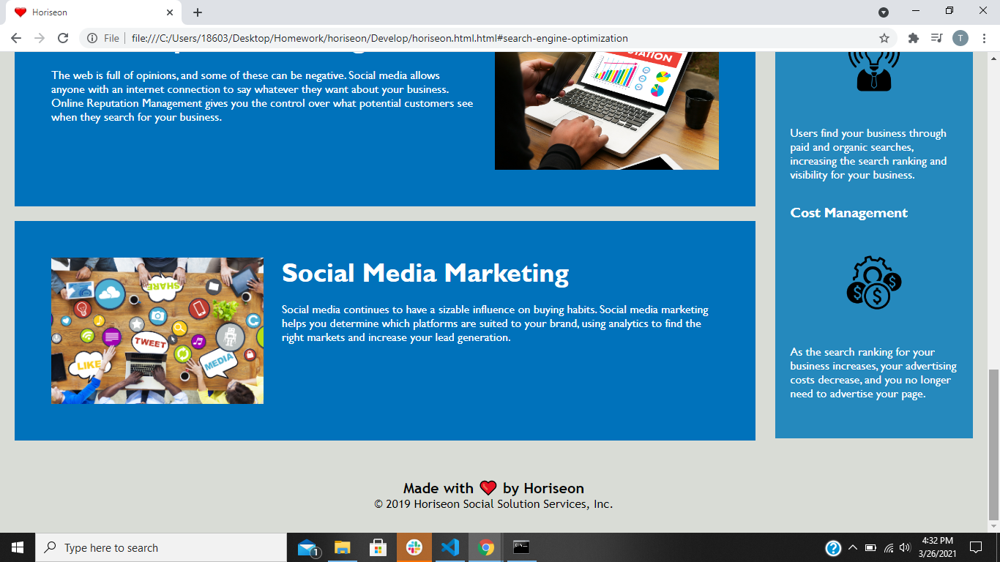

# uconnbootcamp-homework1
UConn coding boot camp homework 1 -  HTML, CSS, Git: Code Refractor.

## Project Overview:
Horiseon would like to make their webpage more compatiable with search engines and more visually appealing to the viewer.  There are various techinical issues to be resolved on html and css.

## Project Goals:
1. Improve the websites searchability by administering proper tags.
2. Repair any broken links/formatting issues.  
3. Make the website more visually appealing by adding a name to head and using heart icon from below as favicon.
4. Optimize code on css style sheet by combining repeating coding.

## Links:
www.horiseon.com

[github]https://github.com/PratikPatel-Code/uconnbootcamp-homework1

